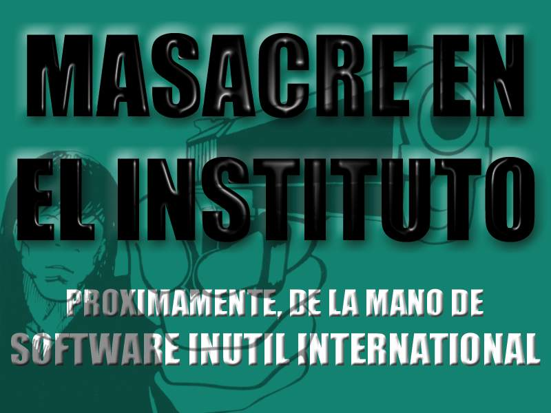

# institutoware

Viejos juegos y programillas que escribí en la segunda mitad de los años 90, cuando tenía quince o dieciséis años e iba al instituto.

Fundamentalmente Turbo Pascal y algo de ensamblador. Todo para MS-DOS.

No creo que nadie quiera correr esto nunca, pero a mí me ha hecho gracia hacerlo un cuarto de siglo después. Para ello he utilizado [DOSBox-x](https://dosbox-x.com).

Da vergüenza ajena publicar esto pero, ¡hey!, pecadillos de juventud. 🙃

Por aquel entonces no había internet. Uno aprendía en casa, por prueba y error. O leyendo el código de otros programas, decompilando binarios… O con algún libro que compré por correo, como «Lenguaje Ensamblador de los 80x86», de Jon Beltrán de Heredia.

Programaba estas cosas al lado de un radiocasete con una cinta copia de una copia de una copia de una copia de una copia de una copia de algún álbum de Extremoduro.

Tampoco se hablaba de _software_ libre: estaba de moda el _shareware_.

Alguna vez grabé alguna de estas creaciones en un disquete y lo envié por correo postal a las revistas de informática juvenil de la época: PC Manía, Hot Shareware…

Como era habitual en la época, tenía mis «marcas»:

- SOFTWARE INÚTIL INTERNATIONAL, cuyo surrealista logo era una rebanada de pan de molde, que digitalicé con un escáner de mesa que pude conseguir.

- VIRUSWARE INDUSTRIES, marca gamberra con la que firmé algunos virus informáticos no destructivos que programaba en casa por las tardes y distribuía por las mañanas en el instituto 🙃.

Adjuntaré a cada programa su código fuente… si lo conservo. (Y sí, me avergüenzo de lo que programa y de mi código, pero me divertía con ello y todo esto es una parte de mi carrera profesional de la que tampoco voy a renegar).

El _setup_ doméstico por aquella época era el de la foto. Nótese el escáner con el que digitalicé la rebanada de pan 😂, la alfombrilla del ratón y toda la parafernalia milénica…

El mamotreto, por cierto, que se ve sobre la mesa es la tercera edición de «Cálculo y Geometría Analítica», el mítico libro de Larson y Hostetler que editó McGraw-Hill en 1992. Tiene más de 1300 páginas. 😅

## Contenidos

### CUTRIS

Un Tetris cutre, (¡aunque no tanto!).

### ARKAFUL

Un clon de Arkanoid con sorpresas.

### MASACRE EN EL INSTITUTO

Un clon del clásico arcade Operation Wolf, solo que en vez de disparar a vietcongs disparaba a mis profesores del instituto. 🤷🏻‍♂️

### KARAOKE

Música MIDI. Este programa de 1994 no es mío; lo encontré en un disquete o CD-ROM de alguna revista. Lo incluyo aquí porque lo pasábamos bien editando las letras de las canciones para

