# institutoware

|                                    |                                     |                                      |
| ---------------------------------- | ----------------------------------- | ------------------------------------ |
| 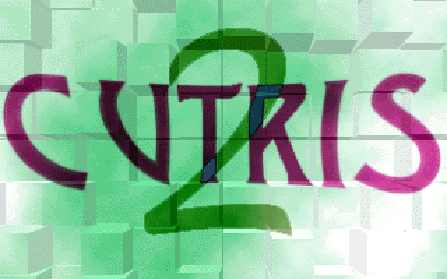 | 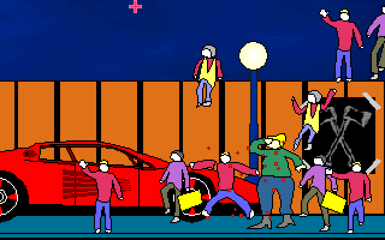 | 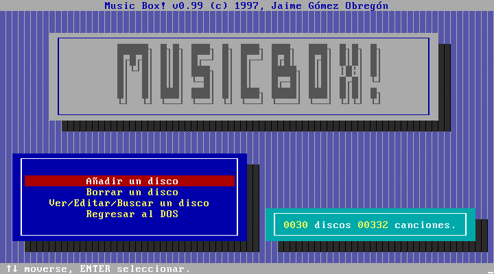 |

Viejos juegos y programillas que escribí en la segunda mitad de los años 90, cuando tenía quince o dieciséis años e iba al instituto. Fundamentalmente en Turbo Pascal 6.0 y algo de ensamblador. Todo para MS-DOS.

Me da vergüenza publicar esto pero, ¡hey!, no has vivido si no has cometido pecadillos de juventud 🙃. Y avergonzarnos de lo que fuimos es, supongo, síntoma de evolución. Me avergüenzo de lo que programaba y de mi código, pero era un chaval adolescente de una ciudad cualquiera que se divertía con ello. Y ahora que lo miro en escorzo, veo que todo esto conforma el kilómetro cero de mi carrera profesional.

No creo que nadie desee correr esto nunca, pero a mí me ha hecho gracia hacerlo y reecontrar un cuarto de siglo después al que soy con el que fui. Para ello he utilizado [DOSBox-x](https://dosbox-x.com):

```bash
dosbox-x -c "mount c ." -c "c:" -c "keyb es"
```

## Por aquel entonces…

Por aquel entonces no había internet en las casas. Lo más parecido era el teletexto, y a la mía nunca llegó. El teléfono era un armatoste atornillado a la pared.

Uno aprendía en casa, por prueba y error. O leyendo el código que publicaban las revistas o te pasaban los amigos. Y destripando los programas de otros o decompilando binarios con el Turbo Debugger, decodificando formatos con un editor hexadecimal… También con algún libro que compré por correo, como «Lenguaje Ensamblador de los 80x86», de Jon Beltrán de Heredia, que devoraba en mi habitación por las tardes, al volver del instituto.

Pero, sobre todo, a programar uno aprende programando. Es por ello que existen estos tontos programas que aquí comparto; como un subproducto de encarar un reto que enganchaba. Ya escribí algo sobre [aquella indescriptible sensación](https://x.com/JaimeObregon/status/1180211354407522304). 😃


Programaba estas cosas en un 486 DX4 a 100 MHz con 8 MB de RAM, fundamentalmente con el IDE de modo texto gualda y azul de Borland, _Turbo Vision_. Y junto a un radiocasete con _auto reverse_ que a menudo reproducía en bucle una cinta TDK con una copia pirata de cualquier disco _punk_ o de rock callejero que circulaba de mano en mano entre los amigos de clase.

El de la foto era mi _setup_ doméstico por aquella época, en mi precaria habitación del piso familiar. Hay un escáner, y mucha parafernalia milénica como la obligatoria y penosa alfombrilla del ratón 🫢. El mamotreto, por cierto, que se ve sobre la mesa es la tercera edición de «Cálculo y Geometría Analítica», el mítico libro de Larson y Hostetler que editó McGraw-Hill en 1992. Tiene más de 1300 páginas. 😅

## El _shareware_

No se hablaba de _software_ libre: la moda era el _shareware_. Programas funcionales de pequeños desarrolladores que se distribuían libremente, y que uno podía apoyar comprando por correo postal la _versión ampliada_.

Alguna vez grababa alguna de estas creaciones mías en un disquete y, también por correo ordinario, la enviaba a las revistas de informática juvenil de la época: PC Manía, Hot Shareware…

¡Recibí dos cartas de usuarios! Un chico de Buenos Aires —con quien [me reencontré 24 años después](https://x.com/JaimeObregon/status/1499157073573130245)— y alguien de Vitoria. Conservo con mucho cariño ambas.


Una nota: hace muchos años que tanto yo como mi familia estamos desvinculados de la dirección postal que aparece en la carta y en los programas.

## Mis marcas

Como era habitual en la época, tenía mis varias «marcas». Y capturan bien la transgresión, el divertimento y el gamberrismo que había en la escena informática juvenil doméstica de aquellos años:

- **SOFTWARE INÚTIL INTERNATIONAL**, cuyo surrealista logo era una rebanada de pan de molde, que digitalicé con un escáner.

- **VIRUSWARE INDUSTRIES**, marca gamberra con la que firmé algunos virus informáticos no destructivos que programaba en casa por las tardes y distribuía por las mañanas en el instituto 🙃.

- **iNTELLIGENT SOFTWARE DEVELOPMENT (iSD)**, con la que suscribí algunos experimentos y pequeñas utilidades que, sin embargo, nunca llegué a distribuir.


Pese a mis ambiciones de dominación mundial 😂 creo que solo llegué a distribuir el Cutris, y los demás programas solo, si acaso, entre mi grupúsculo de amistades _nerd_ del instituto. 🙃

## Los programas

Adjuntaré a cada programa su código fuente… si lo conservo.

Dejo los ficheros de texto (con extensiones `.TXT` y `.DOC`, fundamentalmente) con su codificación original de MS-DOS (CP437), por lo que el arte ASCII, tildes y otros caracteres especiales solo se apreciarán en DOSBox.

## Cutris 2

|                                    |                                    |                                    |
| ---------------------------------- | ---------------------------------- | ---------------------------------- |
|  | 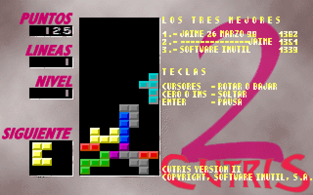 | 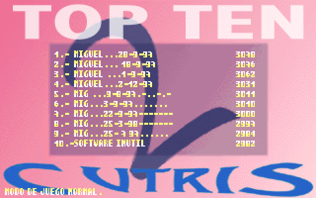 |

La anunciada (en ningún sitio) secuela de mi Cutris, un «tetris cutre»… que no lo era tanto. Tenía dos modos de juego: el clásico y el «txungo» (sic), con piezas más intrincadas.

En el imprescindible listado de récords aparece mi hermano en casi todos los puestos del «top ten».

Me encanta la declaración de copyright a nombre de mi marca SOFTWARE INÚTIL, S.A., emulando con sarcasmo una sociedad anónima 🤣. Lo programé en Turbo Pascal el verano que cumplí 16 años, en 1997. Leo en el _changelog_ que comencé el proyecto el 2 de enero de aquel año.

|                                    |                                    |                                    |
| ---------------------------------- | ---------------------------------- | ---------------------------------- |
| 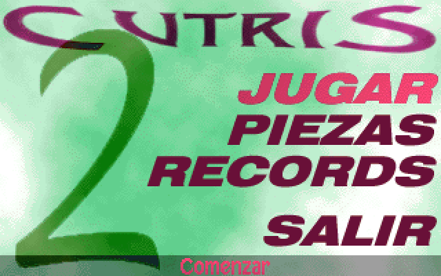 | 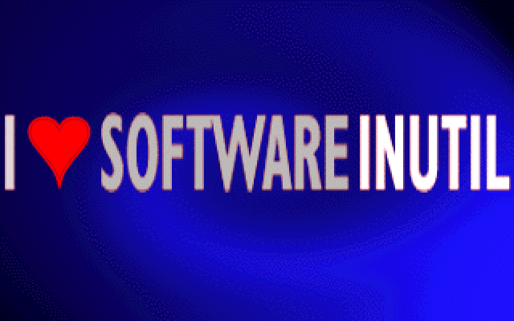 | 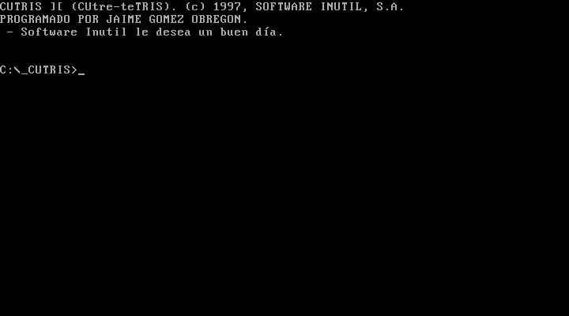 |

Los gráficos los hice, creo, con Photoshop. Creo también que tenía que convertirlos después a un sencillo formato _raster_ propio, porque Turbo Pascal no traía rutinas para decodificar formatos gráficos.

¡Tanto los amigos como en casa echamos unas cuentas horas jugando! 😃

Como muchos de esos programillas que solían circular por las BBS de la época, adjunté un mensaje en `CUTRIS.DOC`. El colofón es toda una oda al arte de reírse de uno mismo 🙃 y a la actitud cómica y desenfadada que envolvía las muchas horas que confeccionar estos programas llevaba:

> SOFTWARE INÚTIL, compañía líder en el sector de los programas que no sirven para nada, ha dado un gran paso hacia adelante en la historia de la informática programando cosas que antes nadie se había atrevido a programar.

## Arkaful

|                                     |                                     |                                     |
| ----------------------------------- | ----------------------------------- | ----------------------------------- |
| 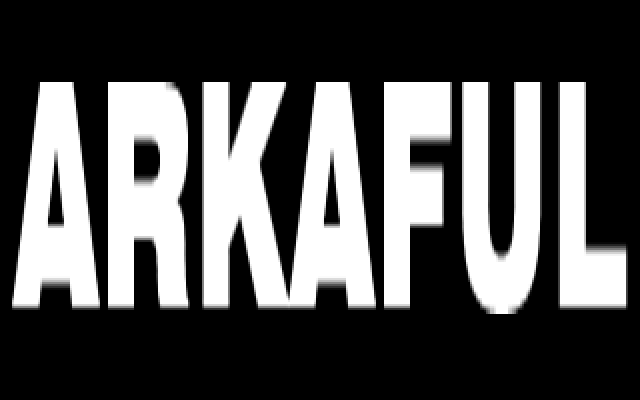 | 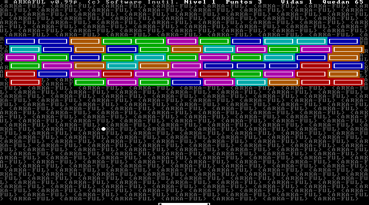 | 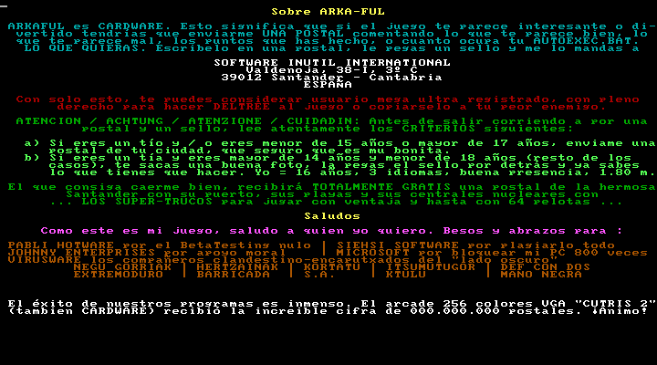 |

Del arrollador éxito de Cutris 2 (ninguno), surtió un Arkanoid que era «una ful», como se decía por entonces —al menos entre mis amigos— cuando algo era extremadamente cutre (y el superlativo «una ful de Estambul»).

Pero ahora diría que Arkaful era un juego muy digno, con un divertido modo de dos jugadores y lleno de sorpresas que caían de algunos ladrillos.

¡Ah, y soportaba la tarjeta de sonido Sound Blaster!

Es también de 1997.

## Music Box!

|                                      |                                      |                                      |
| ------------------------------------ | ------------------------------------ | ------------------------------------ |
|  | 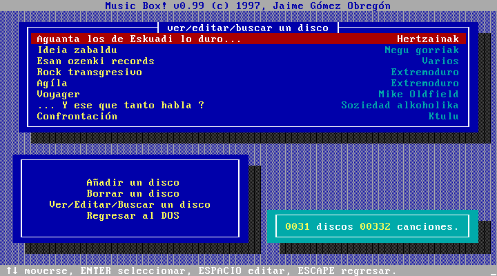 | 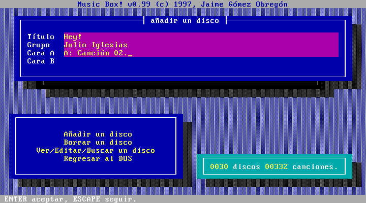 |

El clásico programa que todos los chavales hicimos alguna vez: una utilidad para gestionar una colección musical. En este caso, mi colección de casetes pirata. Lo hice en 1997, cuando tenía 16 años.

## Masacre en el instituto

|                                     |                                     |                                     |
| ----------------------------------- | ----------------------------------- | ----------------------------------- |
|  | 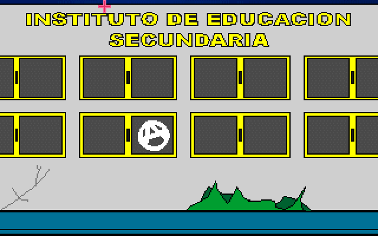 | 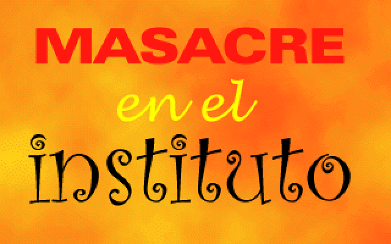 |

Una castiza versión del clásico arcade Operation Wolf, solo que en vez de disparar a _charlies_ disparas a muñecos de cómicos andares con un sospechosísimo parecido a mis profesores del instituto. 😅🤷🏻‍♂️

Recuerdo que el bajito que camina moviendo un maletín era una caricaturización del tal Ernesto, que nos daba Lengua y Literatura en bachillerato. Y el orondo muñeco con bata blanca y un moño recogido, la jefa de estudios. Por supuesto, la Sra. Aldasoro no tenía absolutamente nada que ver con la «[Sra. Urrusolo](https://es.wikipedia.org/wiki/José_Luis_Urrusolo_Sistiaga)» del videojuego…

Durante la intro, que duraba unos segundos, se dibujaba artísticamente sobre la pantalla a un quinqui empuñando una pistola —debí escanearlo de algún sitio— mientras la tarjeta de sonido reproducía la Pequeña Serenata Nocturna de Mozart. 😅

No, no estoy orgulloso de este macabro experimento, pero en aquel momento me parecía divertido.

|                                     |                                     |                                     |
| ----------------------------------- | ----------------------------------- | ----------------------------------- |
| 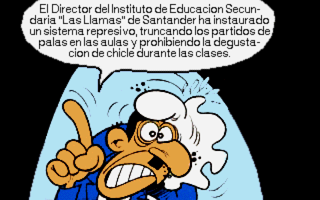 | 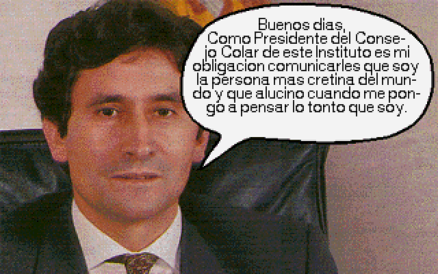 | 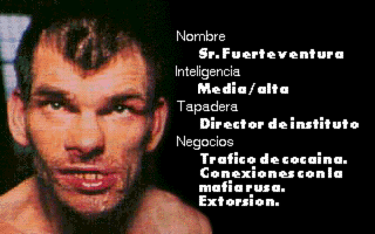 |

El juego es del verano de 1998; año en que comencé el bachillerato. Está ambientado en un distópico y _lejano_… 2007.

Tiene dos ejecutables: `MASACRE.EXE`, que es una elaborada y cómica introducción a la historia, y `JUEGO.EXE`, donde se desarrolla la acción.

Lo programé en Pascal con algunas pinceladas de ensamblador. Las tipografías eran propias, como las rutinas para manejar los _bitplanes_ VGA de la época…

En mis archivos he encontrado incluso un fondo de pantalla «publicitario» de esta lisérgica creación:


Como casi todo lo demás que aquí comparto —salvando el Cutris—, nunca llegué a distribuir este juego, exceptuando el reducido grupo de amigos de la época.

## Anticopy

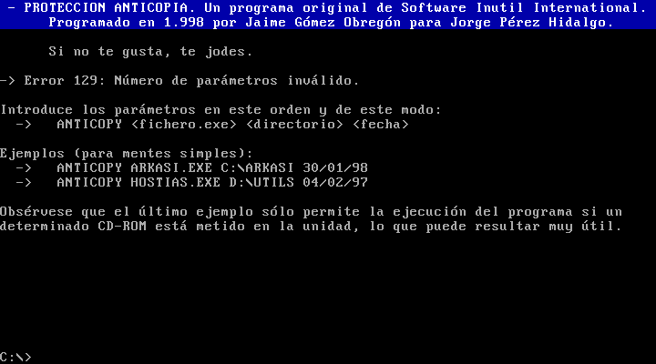

Había olvidado completamente esta curiosa creación que programé en 1998.

Algo de la historia, sin embargo, sí que creo que puedo ahora deducir: un amigo del instituto obtuvo una de las primeras grabadoras de CD-ROM de la ciudad, en torno a la cual enseguida floreció una actividad intensiva de estraperlo de copias pirata de casi cualquier cosa.

Circulábamos de mano en mano recopilaciones en CD-ROM de cientos de pequeños juegos, _shareware_ y utilidades. Mi amigo elaboraba las suyas y, parece que me encargó protegerlas de alguna manera. Los detalles están en un fichero de curioso nombre `NOLEER.SEX`, y parece que eran ingeniosos.

ANTICOPY parcheaba los ejecutables de MS-DOS anteponiendo una rutina que comprobaba si en tu sistema había un determinado directorio con una concreta fecha de creación, ambas conocidas solo por quien parcheaba el binario.

Así te asegurabas de que tal programa solo corría en tu ordenador y no en otros. O que solo lo hiciera si había un determinado CD-ROM insertado en la unidad lectura.

Una curiosa tecnología anticopia… para proteger copias pirata. Lo programé con 16 años.

## ASCII

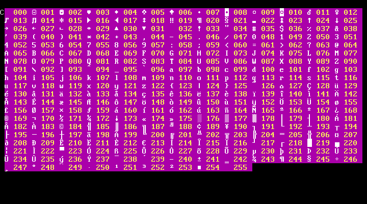

Es un mínimo ejecutable (solo 639 bytes) de los que en MS-DOS se llaman [TSR](https://en.wikipedia.org/wiki/Terminate-and-stay-resident_program) o «residentes», porque siguen latentes en memoria tras devolver el _prompt_ al usuario.

Este que hice —no conservo la fecha, pero supongo que hacia 1997— muestra la tabla de caracteres ASCII al pulsar una combinación de teclas. Esto me resultaba muy práctico a la hora de hacer tablas, líneas o arte ASCII desde otros programas como el IDE de Borland o el propio `EDIT.EXE` que traía MS-DOS.

Lo programé en ensamblador con énfasis en minimizar el consumo de memoria, que era entonces un preciadísimo recurso. El programa escribe directamente en la memoria de vídeo del «modo texto» del sistema.

## SPY

Otro pequeño TSR de 1997. Este queda en ejecución y anota en un fichero ocultable el nombre de todos los programas ejecutados. Una especie de espía para ordenadores de uso compartido…

El programa funcionaba —creo recordar— sobrecargando la interrupción 21h de MS-DOS.

## EXEFPS

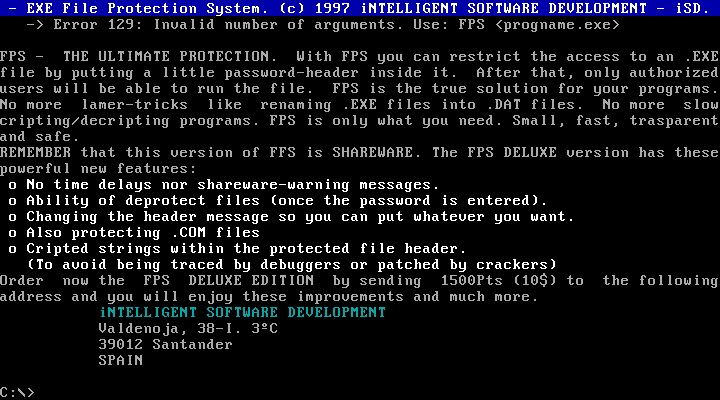

«Executable File Protection System», en el nombre con el que bauticé a este programilla que parcheaba los ejecutables de MS-DOS para redirigir el punto de entrada a una nueva rutina, anexada al binario, que pedía una contraseña.

El usuario podía así restringir la ejecución de programas por parte de terceros.

Lo programé en 1997. Como curiosidad, los textos están en inglés, y acompañaban al programa dos pequeños ficheros de documentación, uno en castellano y el otro en inglés.

## Karaoke

Música MIDI. Este programa de 1994 para Windows 3.11 no es mío; lo encontré en un disquete o CD-ROM de alguna revista.

Lo incluyo aquí porque lo pasábamos bien cambiando las letras de las canciones por versiones absurdas. Recuerdo que había que hacerlo con un editor hexadecimal y mucho cuidado de no alterar la estructura de los ficheros, que venían en un formato propio y, como casi todo en esa época, indocumentado.
