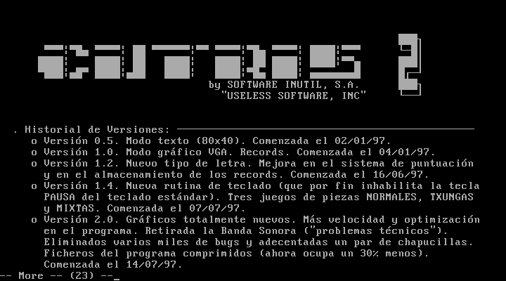
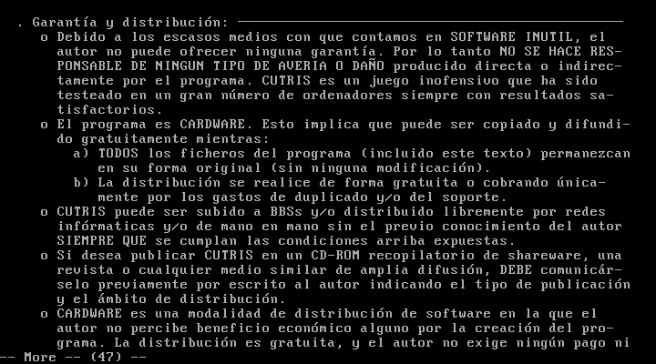
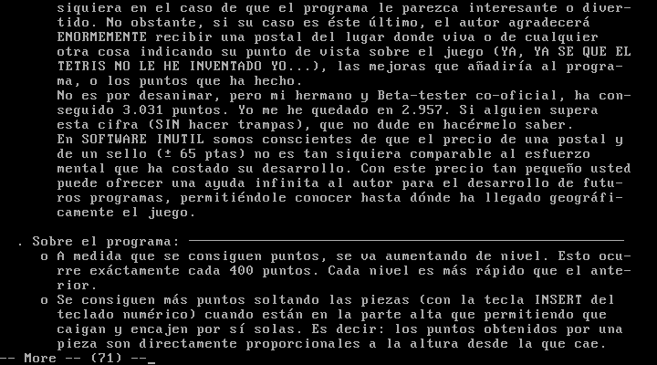
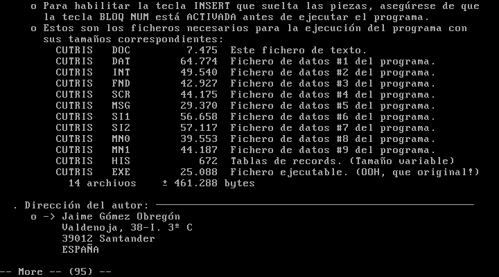
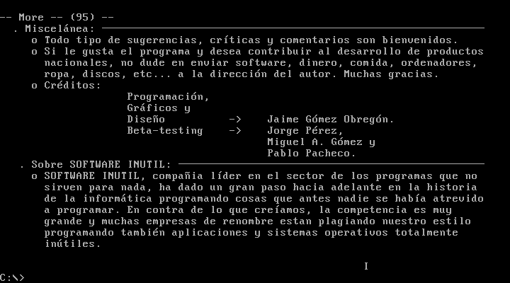

# institutoware

Viejos juegos y programillas que escribí en la segunda mitad de los años 90, cuando tenía quince o dieciséis años e iba al instituto. Fundamentalmente en Turbo Pascal 6.0 y algo de ensamblador. Todo para MS-DOS.

Me da vergüenza publicar esto pero, ¡hey!, no has vivido si no has cometido pecadillos de juventud 🙃. Y avergonzarnos de lo que fuimos es, supongo, síntoma de evolución.

No creo que nadie desee correr esto nunca, pero a mí me ha hecho gracia hacerlo y reecontrar un cuarto de siglo después al que soy con el que fui. Para ello he utilizado [DOSBox-x](https://dosbox-x.com):

```bash
dosbox-x -c "mount c ." -c "c:" -c "keyb es"
```

## Por aquel entonces…

Por aquel entonces no había internet en las casas. Lo más parecido era el teletexto, y a la mía nunca llegó. El teléfono era un armatoste atornillado a la pared.

Uno aprendía en casa, por prueba y error. O leyendo el código que publicaban las revistas o te pasaban los amigos. Y destripando los programas de otros o decompilando binarios con el Turbo Debugger… También con algún libro que compré por correo, como «Lenguaje Ensamblador de los 80x86», de Jon Beltrán de Heredia, que devoraba por las tardes, al volver del instituto.

Pero, sobre todo, a programar uno aprendía programando. Y es por ello que existen estos tontos programas, como un subproducto de encarar un reto que enganchaba. Ya escribí algo sobre [aquella indescriptible sensación](https://x.com/JaimeObregon/status/1180211354407522304) 😃.

Programaba estas cosas fundamentalmente con el IDE de modo texto gualda y azul de Borland, _Turbo Vision_. Y junto a un radiocasete con _auto reverse_ que a menudo reproducía en bucle una cinta TDK con una copia pirata de cualquier disco _punk_ o de rock callejero que circulaba de mano en mano entre los amigos de clase.


El de la foto era mi _setup_ doméstico por aquella época, en mi precaria habitación del piso familiar. Hay un escáner, y mucha parafernalia milénica como la obligatoria y penosa alfombrilla del ratón

El mamotreto, por cierto, que se ve sobre la mesa es la tercera edición de «Cálculo y Geometría Analítica», el mítico libro de Larson y Hostetler que editó McGraw-Hill en 1992. Tiene más de 1300 páginas. 😅

## El _shareware_

No se hablaba de _software_ libre: la moda era el _shareware_. Programas funcionales de pequeños desarrolladores que se distribuían libremente, y que uno podía apoyar comprando por correo postal la _versión ampliada_.

Alguna vez grababa alguna de estas creaciones en un disquete y, también por correo ordinario, lo enviaba a las revistas de informática juvenil de la época: PC Manía, Hot Shareware…

¡Recibí dos cartas de usuarios! Un chico de Buenos Aires —con quien [me reencontré 24 años después](https://x.com/JaimeObregon/status/1499157073573130245)— y alguien de Vitoria.

Como era habitual en la época, tenía mis varias «marcas». Y capturan bien la transgresión, el divertimento y el gamberrismo que había en la escena informática juvenil doméstica de aquellos años:

- **SOFTWARE INÚTIL INTERNATIONAL**, cuyo surrealista logo era una rebanada de pan de molde, que digitalicé con un escáner.

- **VIRUSWARE INDUSTRIES**, marca gamberra con la que firmé algunos virus informáticos no destructivos que programaba en casa por las tardes y distribuía por las mañanas en el instituto 🙃.

- **iNTELLIGENT SOFTWARE DEVELOPMENT (iSD)**, con la que firmé algunos experimentos y pequeñas utilidades.

## Programas

Adjuntaré a cada programa su código fuente… si lo conservo.

Y sí; me avergüenzo de lo que programaba y de mi código, pero me divertía con ello y todo esto conforma el kilómetro cero de mi carrera profesional.

Dejo los ficheros de texto (.TXT y .DOC, fundamentalmente) con sus codificaciones originales de MS-DOS (CP437), por lo que el arte ASCII, tildes y otros caracteres especiales solo se apreciarán en DOSBox.

## Cutris 2

La anunciada (en ningún sitio) secuela de mi Cutris, un «tetris cutre»… que no lo era tanto. Tenía dos modos de juego: el clásico y el «txungo», con piezas más intrincadas.

En el imprescindible listado de récords aparece mi hermano en casi todos los puestos del «top ten».

Me encanta la declaración de copyright a nombre de mi marca SOFTWARE INÚTIL, S.A., emulando una sociedad anónima 🤣. Lo programé en Turbo Pascal el verano que cumplí 16 años, en 1997.

Los gráficos los hice, creo, con Photoshop. Y —también creo— tenía que convertirlos a un sencillo formato _raster_ propio porque Turbo Pascal no traía rutinas para decodificar formatos gráficos.

¡Tanto los amigos como en casa echamos unas cuentas horas jugando!

|                                    |                                    |                                    |                                    |                                    |                                    |
| ---------------------------------- | ---------------------------------- | ---------------------------------- | ---------------------------------- | ---------------------------------- | ---------------------------------- |
|  |  |  |  |  |  |

Como muchos de esos programillas que solían circular por las BBS de la época, adjunté un mensaje en `CUTRIS.DOC`. Hay una parte que es una oda a reírse de uno mismo 🙃 y a la actitud divertida y desenfadada que envolvía las muchas horas que confeccionar estos programas llevaba:

> SOFTWARE INÚTIL, compañía líder en el sector de los programas que no sirven para nada, ha dado un gran paso hacia adelante en la historia de la informática programando cosas que antes nadie se había atrevido a programar.

|                                    |                                    |                                    |                                    |                                    |
| ---------------------------------- | ---------------------------------- | ---------------------------------- | ---------------------------------- | ---------------------------------- |
|  |  |  |  |  |

## Arkaful

Un clon de Arkanoid con sorpresas.

## Music Box!

El clásico programa que todos los chavales hicimos alguna vez: una utilidad para gestionar una colección musical. En este caso, mi colección de casetes pirata. Lo hice en 1997, cuando tenía 16 años.

|                                      |                                      |                                      |
| ------------------------------------ | ------------------------------------ | ------------------------------------ |
|  |  |  |

## Masacre en el Instituto

Un clon del clásico arcade Operation Wolf, solo que en vez de disparar a vietcongs disparaba a mis profesores del instituto. 🤷🏻‍♂️


## Karaoke

Música MIDI. Este programa de 1994 no es mío; lo encontré en un disquete o CD-ROM de alguna revista. Lo incluyo aquí porque lo pasábamos bien editando las letras de las canciones para
